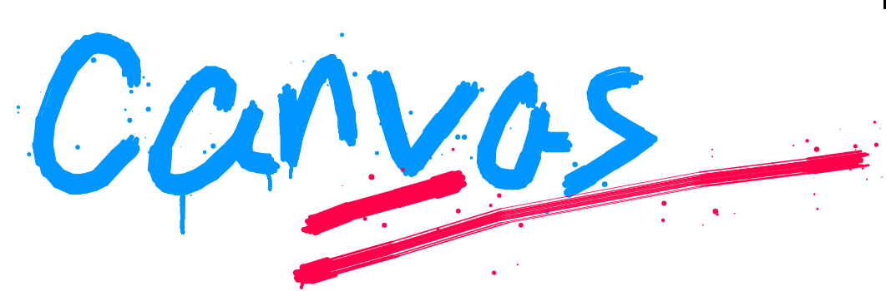

## awesome-canvas
List of awesome HTML5 Canvas with libraries, plugins, examples, course, books and related articles.

## Summary
- [awesome-canvas](#awesome-canvas)
- [Summary](#summary)
- [Tutorials](#tutorials)
- [Books](#books)
- [Libraries](#libraries)
  - [Canvas draw](#canvas-draw)
  - [Charts](#charts)
  - [3D libraries](#3d-libraries)
  - [VR/AR](#vrar)
  - [Flowchart](#flowchart)
  - [Gantt](#gantt)
  - [Organization charts](#organization-charts)
  - [Visual Graph Editing](#visual-graph-editing)
  - [Excel and Spreadsheet](#excel-and-spreadsheet)
  - [Poster and Screenshot](#poster-and-screenshot)
  - [Data processing](#data-processing)
  - [Image processing](#image-processing)
  - [Drawingboard](#drawingboard)
  - [Signature pad](#signature-pad)
  - [Physics engine](#physics-engine)
  - [Game engine](#game-engine)
  - [Waveforms animation](#waveforms-animation)
  - [Particle animation](#particle-animation)
  - [Path animation](#path-animation)
  - [QR code](#qr-code)
  - [Verification code](#verification-code)
  - [Runtime](#runtime)
  - [Others](#others)
- [Resources Website](#resources-website)
- [Plugins](#plugins)
- [Articles](#articles)
- [Contributor](#contributor)
- [License](#license)

## Tutorials
- [Draw on the Web](https://airingursb.gitbooks.io/canvas/content/)
- [The Aesthetics of Graph Visualization](https://www.researchgate.net/publication/220795329_The_Aesthetics_of_Graph_Visualization)
- [Computer Graphics And Visualization](https://ng-tech.icu/CGDataVis-Series/#/)
- [Mozilla Developer Network Canvas Tutorial](https://developer.mozilla.org/zh-CN/docs/Web/API/Canvas_API)
- [Internet Explorer 9 Guide for Developers: HTML5 canvas element](https://docs.microsoft.com/en-us/previous-versions/hh410106(v=msdn.10)?redirectedfrom=MSDN#_HTML5_canvas)
- [The canvas element in the HTML5 draft standard](https://html.spec.whatwg.org/multipage/canvas.html#the-canvas-element)
- [HTML5 Canvas — the Basics](https://dev.opera.com/articles/html5-canvas-basics/)
- [HTML5 Canvas - RUNOOB Tutorial](https://www.runoob.com/html/html5-canvas.html)
- [HTML5 Canvas - W3school Tutorial](https://www.w3school.com.cn/html/html5_canvas.asp)
- [HTML5 Canvas - 廖雪峰 Tutorial](https://www.liaoxuefeng.com/wiki/1022910821149312/1023022423592576)
- [HTML5 Canvas - IMOOC Tutorial](https://www.imooc.com/wiki/html5/canvas.html)
- [The Chinese series of learning tutorials of HTML5 canvas](https://github.com/827652549/CanvasStudy)
- [AntV Graphin - Graph Database White Paper](https://graphin.antv.vision/solution/database/graph-database)
- [AntV Graphin - Knowledge Graph White Paper](https://graphin.antv.vision/solution/knowledge-graph)
- [AntV Graphin - Network Security White Paper](https://graphin.antv.vision/solution/security)
- [AntV Graphin - Enterprise Risk Control White Paper](https://graphin.antv.vision/solution/enterprise/enterprise-risk-control)

## Books
- 《[HTML5 Canvas开发详解](http://product.dangdang.com/11012245144.html)》 Author: Steve Fulton, Jeff Fulton [Link🔗](http://product.dangdang.com/11012245144.html)
- 《[TypeScript图形渲染实战：2D架构设计与实现](http://product.dangdang.com/28499406.html)》 Author: 步磊峰 [Link🔗](http://product.dangdang.com/28499406.html)
- 《[HTML5 Canvas游戏开发实战](http://e.dangdang.com/products/1900396102.html)》 Author: 张路斌 [Link🔗](http://e.dangdang.com/products/1900396102.html)
- 《[从0到1 HTML5 Canvas动画开发](http://product.dangdang.com/28549249.html)》 Author: 莫振杰 [Link🔗](http://product.dangdang.com/28549249.html)
- 《[HTML5 Canvas核心技术: 图形、动画与游戏开发](http://product.dangdang.com/1798930436.html)》 Author: Geary [Link🔗](http://product.dangdang.com/1798930436.html)
- 《[D3 for impatient: interactive Graphics for Programmers and Scientists](http://product.dangdang.com/28556039.html)》 Author: Philipp K. Janert [Link🔗](http://product.dangdang.com/28556039.html)
- 《[如何使用 Canvas 制作出炫酷的网页背景特效](https://juejin.cn/book/6844723714655780871)》 Author: sunshine小小倩 [Link🔗](https://juejin.cn/book/6844723714655780871)
- 《[可视化入门：从 0 到 1 开发一个图表库](https://juejin.cn/book/7031893648145186824)》 Author: AntV [Link🔗](https://juejin.cn/book/7031893648145186824)
- 《[Graph Analysis and Visualization](https://book.douban.com/subject/26756024/)》 Author: Richard Brath  / David Jonker [Link🔗](https://book.douban.com/subject/26756024/)
- 《[Visual Complexity: Mapping Patterns of Information](https://book.douban.com/subject/25665238/)》 Author: Manuel Lima [Link🔗](https://book.douban.com/subject/25665238/)
- 《[Data visualization](https://book.douban.com/subject/25760272/)》 Author: 陈为 / 沈则潜 [Link🔗](https://book.douban.com/subject/25760272/)

## Libraries
### Canvas draw
  - [fabric.js](http://fabricjs.com/) [[Online Demo](http://fabricjs.com/demos/)] - Javascript Canvas Library, SVG-to-Canvas (& canvas-to-SVG) Parser.  
    - [DarkroomJS](https://github.com/MattKetmo/darkroomjs) [[Online Demo](https://pqina.nl/pintura/?affiliate_id=854594675)] - Extensible image editing tool in your browser.  
    - [react-design-editor](https://github.com/salgum1114/react-design-editor) [[Online Demo](https://salgum1114.github.io/react-design-editor/)] - React Design Editor has started to developed direct manipulation of editable design tools like Powerpoint, We've developed it with reactjs, ant.design, fabricjs.  
    - [react-sketch](https://github.com/tbolis/react-sketch) [[Online Demo](http://tbolis.github.io/showcase/react-sketch/)] - Sketch Tool for React-based applications, backed up by FabricJS.  
    - [vue-fabric](https://github.com/purestart/vue-fabric) - Vue fabric component created based on canvas fabric.js library, customized drawing board, picture combination drawing.  
    - [angular-fabric](https://github.com/michaeljcalkins/angular-fabric) [[Online Demo](https://codepen.io/michaeljcalkins/full/Imupw)] - Control a FabricJS canvas with AngularJS.  
    - [fabric-js-editor](https://github.com/danielktaylor/fabric-js-editor) - An HTML5 vector image editor built with Fabric.js.  
    - [fabric-brush](https://github.com/tennisonchan/fabric-brush) [[Online Demo](https://tennisonchan.github.io/fabric-brush/)] - Crayon is a canvas brush based on an awesome framework Fabric.js.  
    - [fabricjs-image-editor-origin](https://github.com/pegasus1982/fabricjs-image-editor-origin) [[Online Demo](https://fabricjs-image-editor-f62330.netlify.app/)] - fabric.js javascript image editor.  
    - [DrawerJs](https://github.com/carstenschaefer/DrawerJs) [[Online Demo](https://carstenschaefer.github.io/DrawerJs/examples/standalone/)] - A customizable WYSIWYG HTML canvas editor.  
    - [myvision](https://github.com/OvidijusParsiunas/myvision) - Computer vision based ML training data generation tool 🚀.  
  - [konva](https://konvajs.org/) [[Online Demo](https://konvajs.org/docs/sandbox/index.html)] - Konva.js is an HTML5 Canvas JavaScript framework that extends the 2d context by enabling canvas interactivity for desktop and mobile applications.  
    - [konva Chinese Docs](http://konvajs-doc.bluehymn.com/docs/)
    - [react-konva](https://konvajs.org/) [[Online Demo](https://codesandbox.io/s/5m3nwp787x)] - React + Canvas = Love. JavaScript library for drawing complex canvas graphics using React.  
    - [vue-konva](https://github.com/konvajs/vue-konva) - Vue & Canvas - JavaScript library for drawing complex canvas graphics using Vue.  
    - [react-proto](https://github.com/React-Proto/react-proto) - 🎨 React application prototyping tool for developers and designers 🏗️.  
  - [two.js](https://two.js.org/#introduction) [[Online Demo](https://two.js.org/examples/)] - A renderer agnostic two-dimensional drawing api for the web.  
  - [EaselJS](https://www.createjs.com/getting-started/easeljs) - The Easel Javascript library provides a full, hierarchical display list, a core interaction model, and helper classes to make working with the HTML5 Canvas element much easier.  
  - [spritejs](https://spritejs.org/#/) [[Online Demo](https://spritejs.org/demo/)] - A cross platform high-performance graphics system.  
  - [concretejs](http://www.concretejs.com/) [[Online Demo](http://www.concretejs.com/#examples)]- A lightweight Html5 Canvas framework that enables hit detection, layer support, pixel ratio management, exports, and downloads. 
  - [cax](https://github.com/dntzhang/cax/blob/master/README.CN.md) [[Online Demo](https://github.com/dntzhang/cax/blob/master/README.CN.md)] - HTML5 Canvas 2D Rendering Engine.  
  - [wxDraw](https://bobiscool.github.io/wxDrawDocs/#/) [[Online Demo](https://github.com/bobiscool/wxDraw#wxdraw%E5%88%9B%E4%BD%9C%E7%9A%84%E5%8A%A8%E7%94%BB%E6%BC%94%E7%A4%BA)] - A lightweight canvas library which providing 2d draw for weapp.  
  - [atrament.js](https://github.com/jakubfiala/atrament.js) - A small JS library for beautiful drawing and handwriting on the HTML Canvas.  
  - [origami.js](https://raphamorim.io/origamijs/docs/) - Powerful and Lightweight Library to create using HTML5 Canvas.  
  - [react-native-sketch-canvas](https://github.com/terrylinla/react-native-sketch-canvas) [[Online Demo]()] - A React Native component for drawing by touching on both iOS and Android.  

### Charts
  - [D3](https://github.com/d3/d3) [[Online Demo](https://observablehq.com/@d3/gallery)] - Bring data to life with SVG, Canvas and HTML. 📊📈🎉  
    - [awesome-d3](https://github.com/wbkd/awesome-d3) - A list of D3 libraries, plugins and utilities.  
    - [angular-charts](https://github.com/chinmaymk/angular-charts) - angular directives for creating common charts using d3.  
    - [nvd3](http://nvd3-community.github.io/nvd3/examples/documentation.html) [[Online Demo](http://nvd3-community.github.io/nvd3/)] - angular directives for creating common charts using d3.  
    - [c3](https://c3js.org/) [[Online Demo](https://c3js.org/examples.html)] - 📊 A D3-based reusable chart library.  
    - [dc.js](https://github.com/dc-js/dc.js) [[Online Demo](http://dc-js.github.io/dc.js/)] - Multi-Dimensional charting built to work natively with crossfilter rendered with d3.js.  
    - [britecharts](https://britecharts.github.io/britecharts/) [[Online Demo](https://britecharts.github.io/britecharts/tutorial-bar.html)] - Client-side reusable Charting Library based on D3.js v5 that allows easy and intuitive use of charts and components that can be composed together creating amazing visualizations.  
    - [neo4jd3](https://github.com/eisman/neo4jd3) [[Online Demo](https://britecharts.github.io/britecharts/tutorial-bar.html)] - Neo4j graph visualization using D3.js  

  - [echarts](https://github.com/apache/echarts) [[Online Demo](https://echarts.apache.org/examples/zh/index.html)] - Apache ECharts is a powerful, interactive charting and data visualization library for browser.  
    - [v-charts](https://v-charts.js.org/#/) [[Online Demo](https://codesandbox.io/s/z69myovqzx)] - 基于 Vue2.0 和 ECharts 封装的图表组件📈📊.  
    - [echarts-for-weixin](https://github.com/ecomfe/echarts-for-weixin) - Apache ECharts (incubating) Apache ECharts (incubating) for wechat app.  

  - [Chart.js](https://github.com/chartjs/Chart.js) [[Online Demo](https://www.chartjs.org/docs/latest/samples/bar/vertical.html)] - Simple HTML5 Charts using the **canvas** tag.  
    - [vue-chartjs](https://vue-chartjs.org/zh-cn/) [[Online Demo](http://demo.vue-chartjs.org/)] - 📊 Vue.js wrapper for Chart.js  
    - [react-chartjs](https://github.com/reactjs/react-chartjs) [[Online Demo]()] - common react charting components using chart.js  
    - [angular-chart.js](http://jtblin.github.io/angular-chart.js/) [[Online Demo](http://jtblin.github.io/angular-chart.js/#top)] - Reactive, responsive, beautiful charts for AngularJS using Chart.js  

  - [AntV](https://antv.vision/) - A new generation of data visualization solution from Ant Group.
    - [G2](https://github.com/antvis/g2) [[Online Demo](https://g2.antv.vision/zh/examples/gallery)] - 📊 A highly interactive data-driven visualization grammar for statistical charts.  
    - [G6](https://g6.antv.vision/zh) [[Online Demo](https://g6.antv.vision/zh/examples/gallery)] - ♾ A Graph Visualization Framework in JavaScript.  
    - [G](https://g-next.antv.vision/en/docs/guide/introduce) [[Online Demo](https://g-next.antv.vision/en/examples/shape)] - A powerful rendering engine implemented with Canvas2D / SVG / WebGL / WebGPU.  
    - [X6](https://x6.antv.vision/zh) [[Online Demo](https://x6.antv.vision/zh/examples/gallery)] - 🚀 JavaScript diagramming library that uses SVG and HTML for rendering.  
    - [S2](https://github.com/antvis/s2) [[Online Demo](https://s2.antv.vision/zh/examples/gallery)] - ⚡️ Practical analytical Table rendering core lib.  
    - [L7](https://l7.antv.vision/zh) [[Online Demo](https://l7.antv.vision/en/examples/gallery)] - 🌎 Large-scale WebGL-powered Geospatial Data Visualization analysis framework which relies on Mapbox GL or AMap to render basemaps.  
    - [F2](https://antv-f2.gitee.io/zh/docs/tutorial/getting-started) [[Online Demo](https://antv-f2.gitee.io/zh/examples/gallery)] - 📱📈An elegant, interactive and flexible charting library for mobile.  
    - [F6](https://f6.antv.vision/zh) [[Online Demo](https://f6.antv.vision/zh/docs/examples/tree/compactBox)] - F6 is a graph visualization engine which provides quick and smooth operations on mobile devices.  
    - [F2Native](https://f2native.antv.vision/en) [[Online Demo](https://f2native.antv.vision/en/docs/examples/line/line)] - iphonechart_with_upwards_trendAn elegant, interactive and flexible native charting library for mobile.  
    - [G2Plot](https://github.com/antvis/g2plot) [[Online Demo](https://g2plot.antv.vision/zh/examples/gallery)] - 🍡 An interactive and responsive charting library.  
    - [Graphin](https://graphin.antv.vision/) [[Online Demo](https://graphin.antv.vision/components/interaction/context-menu)] - A React toolkit for graph visualization based on G6.  
    - [XFlow](https://xflow.antv.vision/en-US) [[Online Demo](https://xflow.antv.vision/en-US/docs/tutorial/intro/getting-started)] - Based on X6 & React, professional solution for graph editing engine.  
    - [L7Plot](https://l7plot.antv.vision/en) [[Online Demo](https://l7plot.antv.vision/en/examples/gallery)] - L7Plot is easy to use, rich charts, support customized geospatial charts Library.  
    - [Ant Design Charts](https://charts.ant.design/en) [[Online Demo](https://charts.ant.design/en/examples/gallery)] - A React Chart Library  
    - [AVA](https://ava.antv.vision/en) [[Online Demo](https://ava.antv.vision/en/examples/gallery)] - robot A framework for automated visual analytics.  
    - [Viser](https://viserjs.github.io/) [[Online Demo](https://viserjs.github.io/demoHome.html)] - A toolkit fit for data vis engineer based on G2. Support React, Vue and AngularJS.  
  - [highcharts](https://github.com/highcharts/highcharts) [[Online Demo](https://www.highcharts.com/demo)] - Highcharts JS, the JavaScript charting framework.  

  - [wx-charts](https://github.com/xiaolin3303/wx-charts) [[Online Demo](https://github.com/xiaolin3303/wx-charts-demo)] - Charts for WeChat Mini Program.  

  - [wordcloud2.js](https://github.com/timdream/wordcloud2.js) [[Online Demo](https://wordcloud2-js.timdream.org/#love)] - Tag cloud/Wordle presentation on 2D canvas or HTML.  

  - [chartist-js](https://github.com/gionkunz/chartist-js) [[Online Demo](http://gionkunz.github.io/chartist-js/examples.html)] - Simple responsive charts.  

  - [charts](https://frappe.io/charts/docs) [[Online Demo](https://frappe.io/charts)] - Simple, responsive, modern SVG Charts with zero dependencies.  

  - [flot](http://www.flotcharts.org/) [[Online Demo](http://www.flotcharts.org/flot/examples/)] - Attractive JavaScript charts for jQuery.  

  - [apexcharts.js](https://apexcharts.com/) [[Online Demo](https://apexcharts.com/javascript-chart-demos/)] - 📊 Interactive JavaScript Charts built on SVG.  

  - [plotly.js](https://github.com/plotly/plotly.js) [[Online Demo](https://plotly.com/javascript/)] - Open-source JavaScript charting library behind Plotly and Dash.  

  - [easy-pie-chart](https://github.com/rendro/easy-pie-chart) - easy pie chart is a lightweight plugin to draw simple, animated pie charts for single values.  

  - [react-vis](https://github.com/uber/react-vis) [[Online Demo](http://uber.github.io/react-vis/examples/showcases/axes)] - Data Visualization Components.  
  - [vega](https://vega.github.io/vega) [[Online Demo](https://vega.github.io/vega/examples/)] - A visualization grammar.  
  - [heatmap.js](https://github.com/pa7/heatmap.js) - 🔥 JavaScript Library for HTML5 canvas based heatmaps.  
  - [zeu](https://github.com/shzlw/zeu) [[Online Demo](https://shzlw.github.io/zeu/examples/my-command-center.html)] - A JavaScript library for real-time visualization.  
  - [HQChart](https://github.com/jones2000/HQChart) - Wechat applet Shanghai and Shenzhen / Hong Kong stocks / digital currency / futures / U.S. stock K-line (Kline), trend chart, zoom, drag, crosshairs, drawing tools, screenshots, chip charts, analyst syntax, tongdaxin syntax, (wheat syntax), third-party data replacement interface.  
  - [canvas-gauges](https://github.com/Mikhus/canvas-gauges) [[Online Demo](http://canvas-gauges.com/documentation/examples/)] - HTML5 Canvas Gauge. Tiny implementation of highly configurable gauge using pure JavaScript and HTML5 canvas. No dependencies. Suitable for IoT devices because of minimum code base.  

### 3D libraries
  - [three.js](https://github.com/mrdoob/three.js) [[Online Demo](https://threejs.org/examples/)] - JavaScript 3D Library.  
  - [zdog](https://github.com/metafizzy/zdog) [[Online Demo](https://zzz.dog/)] - Flat, round, designer-friendly pseudo-3D engine for canvas & SVG  
  - [curtainsjs](https://www.curtainsjs.com/get-started.html) [[Online Demo](https://www.curtainsjs.com/get-started.html#basic-setup)] - curtains.js is a lightweight vanilla WebGL javascript library that turns HTML DOM elements into interactive textured planes.  
  - [obelisk.js](https://github.com/nosir/obelisk.js) - Build pixel isometric graphics with HTML5 canvas  
  - [seen](http://seenjs.io/) [[Online Demo](http://seenjs.io/demo-simple-interactive.html)] - Render 3D scenes into SVG or HTML5 Canvas.  
  - [Oimo.js](https://github.com/lo-th/Oimo.js) [[Online Demo](http://lo-th.github.io/Oimo.js/index.html#basic)] - Lightweight 3d physics engine for javascript.  
  - [troika](https://protectwise.github.io/troika/) [[Online Demo]()] - A JavaScript framework for interactive 3D and 2D visualizations.  
  - [phoria.js](https://github.com/kevinroast/phoria.js) [[Online Demo](http://www.kevs3d.co.uk/dev/phoria/index.html)] - JavaScript library for simple 3D graphics and visualisation on a HTML5 canvas 2D renderer. It does not use WebGL. Works on all HTML5 browsers, including desktop, iOS and Android.  
  - [isomer](https://github.com/jdan/isomer) [[Online Demo](http://jdan.github.io/isomer/)] - Simple isometric graphics library for HTML5 canvas.  

### VR/AR
  - [Panolens.js](https://github.com/pchen66/panolens.js) [[Online Demo](https://pchen66.github.io/Panolens/)] - Javascript panorama viewer based on Three.js  
  - [Pannellum](https://github.com/mpetroff/pannellum) [[Online Demo](https://pannellum.org/)] - Pannellum is a lightweight, free, and open source panorama viewer for the web.  
  - [Marzipano](https://github.com/google/marzipano) [[Online Demo](https://www.marzipano.net/demos/sample-tour/)] A 360° media viewer for the modern web.  
  - [JS-Cloudimage-360-View](https://github.com/scaleflex/js-cloudimage-360-view) [[Online Demo](https://scaleflex.github.io/js-cloudimage-360-view/)] Engage your customers with a stunning 360 view of your products.   
  - [A-Frame](https://github.com/aframevr/aframe) [[Online Demo](https://aframe.io/)] 🅰️ web framework for building virtual reality experiences.  
  - [exokit](https://github.com/exokitxr/exokit) [[Online Demo](https://exokit.org/)] - Native VR/AR/XR engine for JavaScript 🦖  
  - [webvr-boilerplate](https://github.com/borismus/webvr-boilerplate) [[Online Demo](https://borismus.github.io/webvr-boilerplate/#)] - A starting point for web-based VR experiences that work on all VR headsets.  

### Flowchart
  - [GOJS](https://gojs.net/latest/index.html) [[Online Demo](https://gojs.net/latest/samples/)] - JavaScript diagramming library for interactive flowcharts, org charts, design tools, planning tools, visual languages.  
  - [Drawflow](https://github.com/jerosoler/Drawflow) [[Online Demo](https://jerosoler.github.io/Drawflow/)] - Simple flow library 🖥️🖱️  
  - [Flowy](https://github.com/alyssaxuu/flowy) [[Online Demo](https://alyssax.com/x/flowy/)] - The minimal javascript library to create flowcharts ✨  
  - [flowchart.js](https://github.com/adrai/flowchart.js) - Draws simple SVG flow chart diagrams from textual representation of the diagram.  
  - [mermaid](https://github.com/mermaid-js/mermaid) [[Online Demo](https://mermaidjs.github.io/mermaid-live-editor/#/edit/eyJjb2RlIjoiZ3JhcGggVERcbiAgICBBW0hhcmRdIC0tPnxUZXh0fCBCKFJvdW5kKVxuICAgIEIgLS0-IEN7RGVjaXNpb259XG4gICAgQyAtLT58T25lfCBEW1Jlc3VsdCAxXVxuICAgIEMgLS0-fFR3b3wgRVtSZXN1bHQgMl0iLCJtZXJtYWlkIjp7InRoZW1lIjoiZGVmYXVsdCJ9fQ)] - Generation of diagram and flowchart from text in a similar manner as markdown.  
  - [wireflow](https://github.com/vanila-io/wireflow) [[Online Demo](https://app.wireflow.co/)] - Wireflow - user flow chart real-time collaborative tool.  
  - [butterfly](https://github.com/alibaba/butterfly) [[Online Demo](https://butterfly-dag.gitee.io/butterfly-dag/demo/analysis)] - 🦋Butterfly，A JavaScript/React/Vue2 Diagramming library which concentrate on flow layout field.   

### Gantt
  - The following Gantt chart is not implemented based on canvas:
    - [gantt](https://github.com/frappe/gantt) [[Online Demo](https://frappe.io/gantt)] - Open Source Javascript Gantt.  
    - [jQueryGantt](https://github.com/robicch/jQueryGantt) [[Online Demo](https://gantt.twproject.com/)] - jQuery Gantt editor.  
    - [Gantt-Chart](https://github.com/dk8996/Gantt-Chart) [[Online Demo](http://bl.ocks.org/dk8996/5534835)] - Gantt chart library using D3.js.  
    - [gantt-schedule-timeline-calendar](https://github.com/neuronetio/gantt-schedule-timeline-calendar) [[Online Demo](https://gantt-schedule-timeline-calendar.neuronet.io/examples)] - Gantt Gantt Gantt Timeline Schedule Calendar [ javascript gantt, js gantt, projects gantt, timeline, scheduler, gantt timeline, reservation timeline, react gantt, angular gantt, vue gantt, svelte gantt, booking manager ]  
    - [dhtmlxGantt](https://github.com/DHTMLX/gantt) [[Online Demo](https://docs.dhtmlx.com/gantt/samples/01_initialization/08_explicit_time_range.html)] - GPL version of Javascript Gantt Chart.  
    - [gantt-for-react](https://github.com/hustcc/gantt-for-react) [[Online Demo](https://git.hust.cc/gantt-for-react/)] - 🌿 Frappe Gantt components for React wrapper.  
    - [jquery.ganttView](https://github.com/thegrubbsian/jquery.ganttView) [[Online Demo](http://thegrubbsian.github.io/jquery.ganttView/example/index.html)] - An editable jQuery Gantt chart plugin.  
    - [wl-gantt](https://github.com/hql7/wl-gantt) - An easy-to-use gantt plug-in for the vue framework.  

### Organization charts
  - [OrgChart](https://github.com/dabeng/OrgChart/blob/master/README.zh-cn.md) [[Online Demo](https://dabeng.github.io/OrgChart/)] - It's a simple and direct organization chart plugin. Anytime you want a tree-like chart, you can turn to OrgChart.  

### Visual Graph Editing
  - [Workflow Designer](https://github.com/guozhaolong/wfd) [[Online Demo](https://guozhaolong.github.io/wfd/)] - flowable workflow designer base on @antv/g6。  
  - [vue-g6-editor](https://github.com/caoyu48/vue-g6-editor) [[Online Demo](https://github.com/caoyu48/vue-g6-editor/blob/master/1.gif)] - Visual graph editor based on vue ande g6.  
  - [X-Flowchart-Vue](https://github.com/OXOYO/X-Flowchart-Vue) [[Online Demo](http://oxoyo.co/X-Flowchart-Vue/)] - A visual graph editor based on G6 and Vue.  
  - [web-pdm](https://erd.zyking.xyz/) [[Online Demo](https://erd.zyking.xyz/demo)] - ER graph tools based on G6, the ultimate goal is to make an online version of powerdesigner.  
  - [ng-antv](https://github.com/dappsnation/ng-antv) - Angular wrapper around the antv libraries.  
  - [welabx-g6](https://github.com/claudewowo/welabx-g6) [[Online Demo](https://claudewowo.github.io/welabx-g6/dist/?_blank)] - welabx - antv G6.  

### Excel and Spreadsheet
  - [x-spreadsheet](https://github.com/myliang/x-spreadsheet) [[Online Demo](https://myliang.github.io/x-spreadsheet/)] - A web-based JavaScript（canvas） spreadsheet.  
  - [Luckysheet](https://github.com/mengshukeji/Luckysheet/blob/master/README-zh.md) [[Online Demo](https://mengshukeji.github.io/LuckysheetDemo/)] - Luckysheet is an online spreadsheet like excel that is powerful, simple to configure, and completely open source.  
  - [sheetsee.js](https://github.com/jlord/sheetsee.js) - 👀 📈 Visualize Data from a Google Spreadsheet.  
  - [SlickGrid](https://github.com/mleibman/SlickGrid) [[Online Demo](http://6pac.github.io/SlickGrid/examples/example4-model.html)] - A lightning fast JavaScript grid/spreadsheet.  
  - [handsontable](https://github.com/handsontable/handsontable) [[Online Demo](https://handsontable.com/demo)] - JavaScript data grid with a spreadsheet look & feel. Works with React, Angular, and Vue. Supported by the Handsontable team ⚡  
  - [cheetah-grid](https://github.com/future-architect/cheetah-grid) [[Online Demo](https://future-architect.github.io/cheetah-grid/#/)] - The fastest open-source data table for web.  
  - [Jspreadsheet CE](https://github.com/jspreadsheet/ce) [[Online Demo](https://bossanova.uk/jspreadsheet/v4/examples)] - Jspreadsheet is a lightweight vanilla javascript plugin to create amazing web-based interactive tables and spreadsheets compatible with other spreadsheet software.  
  - [canvas-datagrid](https://github.com/TonyGermaneri/canvas-datagrid) [[Online Demo](https://canvas-datagrid.js.org/demo.html)] - Canvas based data grid web component. Capable of displaying millions of contiguous hierarchical rows and columns without paging or loading, on a single canvas element.  

### Poster and Screenshot
  - [html2canvas](https://html2canvas.hertzen.com/) [[Online Demo](https://html2canvas.hertzen.com/)] - Screenshots with JavaScript.  
  - [dom-to-image](https://github.com/tsayen/dom-to-image) - Generates an image from a DOM node using HTML5 canvas.  
  - [html-to-image](https://github.com/bubkoo/html-to-image) - ✂️ Generates an image from a DOM node using HTML5 canvas and SVG.  
  - [canvas2image](https://github.com/hongru/canvas2image) [[Online Demo](https://github.com/hongru/canvas2image/blob/master/index.html)] - a tool for saving or converting canvas as img.  
  - [mp_canvas_drawer](https://github.com/kuckboy1994/mp_canvas_drawer) [[Online Demo](https://github.com/kuckboy1994/mp_canvas_drawer#%E6%BC%94%E7%A4%BA)] - Canvas drawing picture assistant on wechat miniapp, making and sharing pictures of circle of friends with a JSON.  
  - [vue-canvas-poster](https://github.com/sunniejs/vue-canvas-poster) [[Online Demo](https://www.sunniejs.cn/vant-demo/#/example/poster)] - Vue poster,a lightweight vue component that draws canvas images via css properties.  

### Data processing
  - [html2pdf.js](https://github.com/eKoopmans/html2pdf.js) - Client-side HTML-to-PDF rendering using pure JS.  
  - [rasterizeHTML.js](https://github.com/cburgmer/rasterizeHTML.js) - Renders HTML into the browser's canvas.  
  - [JavaScript-Canvas-to-Blob](https://github.com/blueimp/JavaScript-Canvas-to-Blob) - JavaScript Canvas to Blob is a function to convert canvas elements into Blob objects.  
  - [jsgif](https://github.com/antimatter15/jsgif) - Save a HTML5 Canvas to GIF and Animations. A port of as3gif GIFPlayer to JS.  
  - [whammy](https://github.com/antimatter15/whammy) - A real time javascript webm encoder based on a canvas hack.  
  - [js-imagediff](https://github.com/HumbleSoftware/js-imagediff) - JavaScript / Canvas based image diff utility with Jasmine matchers for testing canvas.  

### Image processing
  - [tui.image-editor](https://github.com/nhn/tui.image-editor) [[Online Demo](http://nhn.github.io/tui.image-editor/latest/tutorial-example01-includeUi)] - 🍞🎨 Full-featured photo image editor using canvas. It is really easy, and it comes with great filters.  
  - [merge-images](https://github.com/lukechilds/merge-images) - Easily compose images together without messing around with canvas.  
  - [we-cropper](https://we-plugin.github.io/we-cropper/#/) [[Online Demo](https://unpkg.com/we-cropper@1.2.0/docs/assets/online.jpg)] - Wechat miniapp image cutting tool.  
  - [miniPaint](https://github.com/viliusle/miniPaint) [[Online Demo](https://viliusle.github.io/miniPaint/)] - online image editor.  
  - [animockup](https://github.com/alyssaxuu/animockup) [[Online Demo](https://animockup.com/)] - Create animated mockups in the browser 🔥  
  - [vintageJS](https://github.com/rendro/vintageJS) - Add a retro/vintage effect to images using the HTML5 canvas element.  
  - [glitch-canvas](https://github.com/snorpey/glitch-canvas) [[Online Demo](https://snorpey.github.io/jpg-glitch/)] - glitch your canvas element.  
  - [JIC](https://github.com/brunobar79/J-I-C) [[Online Demo](http://makeitsolutions.com/labs/jic/)] - J I C is a Javascript Image Compressor using HTML5 Canvas & File API that allows you to compress your jpeg & png images before uploading to the server (100% client-side and no extra libraries required!).  
  - [context-blender](https://github.com/Phrogz/context-blender) - Photoshop-style blend modes for HTML Canvas Contexts.  
  - [ios-imagefile-megapixel](https://github.com/stomita/ios-imagefile-megapixel) - Fixes iOS6 Safari's image file rendering issue for large size image (over mega-pixel), which causes unexpected subsampling when drawing it in canvas.  

### Drawingboard
  - [jspaint](https://github.com/1j01/jspaint) [[Online Demo](https://jspaint.app/#local:5ee9c6aab5992)] - 🎨 Classic MS Paint, ＲＥＶＩＶＥＤ + ✨Extras.  
  - [drawingboard.js](https://github.com/Leimi/drawingboard.js) [[Online Demo](http://leimi.github.io/drawingboard.js/)] - A canvas based drawing app that you can integrate easily on your website.  
  - [drawingboard](https://github.com/vipstone/drawingboard) [[Online Demo](https://vipstone.github.io/drawingboard/drawingboard/index.html)] - Advanced Sketchpad - freehand, straight / dashed lines, arrows, all geometry.  
  - [draw](https://github.com/amoshydra/draw) [[Online Demo](https://amoshydra.github.io/draw/)] - Web canvas that support pen pressure.  

### Signature pad
  - [signature_pad](https://github.com/szimek/signature_pad) [[Online Demo](http://szimek.github.io/signature_pad/)] - HTML5 canvas based smooth signature drawing.  
    - [vue-signature-pad](https://github.com/neighborhood999/vue-signature-pad) [[Online Demo](https://codesandbox.io/s/n5qjp3oqv4)] - 🖋 Vue Signature Pad Component.  
    - [react-signature-pad](https://github.com/blackjk3/react-signature-pad) - A signature pad implementation for react.  
    - [angular-signature](https://github.com/legalthings/angular-signature) - HTML5 canvas based smooth signature drawing as angularJS directive.  
    - [react-native-signature-pad](https://github.com/kevinstumpf/react-native-signature-pad) - React Native wrapper around szimek's Canvas based Signature Pad.  
  - [signature-pad](https://github.com/thread-pond/signature-pad) [[Online Demo](https://thread-pond.github.io/signature-pad/examples/require-drawn-signature.html)] - A jQuery plugin for assisting in the creation of an HTML5 canvas based signature pad. Records the drawn signature in JSON for later regeneration.  
  - [canvas-draw](https://github.com/Louiszhai/canvas-draw) [[Online Demo](http://louiszhai.github.io/res/canvasDraw/#/sign)] - Handwritten signature or drawing with canvas -- supports PC and mobile terminals and horizontal screen.  

### Physics engine
  - [matter-js](https://brm.io/matter-js/) [[Online Demo](https://brm.io/matter-js/demo/#mixed)] - a 2D rigid body physics engine for the web ▲● ■  
  - [box2d.js](https://github.com/kripken/box2d.js) [[Online Demo](http://kripken.github.io/box2d.js/demo/webgl/box2d.html)] - Port of Box2D to JavaScript using Emscripten.  
  - [p2.js](https://github.com/schteppe/p2.js) [[Online Demo](http://schteppe.github.io/p2.js/demos/springs.html)] - JavaScript 2D physics library.  

### Game engine
  - [Hilo](https://github.com/hiloteam/Hilo/blob/dev/README_ZH.md) [[Online Demo](https://hiloteam.github.io/examples/index.html)] - A Cross-end HTML5 Game development solution developed by Alibaba Group.  
  - [melonJS](https://melonjs.org/) [[Online Demo](https://www.melongaming.com/)] - a fresh & lightweight javascript game engine.  
  - [Babylon.js](https://github.com/BabylonJS/Babylon.js) [[Online Demo](https://www.babylonjs.com/community/)] - Babylon.js is a powerful, beautiful, simple, and open game and rendering engine packed into a friendly JavaScript framework.  
  - [Phaser](https://github.com/photonstorm/phaser) [[Online Demo](https://phaser.io/examples)] - Phaser is a fun, free and fast 2D game framework for making HTML5 games for desktop and mobile web browsers, supporting Canvas and WebGL rendering.  
    - [phaser-examples](https://github.com/photonstorm/phaser-examples) - Contains hundreds of source code examples and related media for the Phaser HTML5 Game Framework.  
    - [games](https://github.com/channingbreeze/games) - List of small games based on phaser  
    - [phaser3-examples](https://github.com/photonstorm/phaser3-examples) - Phaser 3 Examples.  
    - [phaser-ce](https://github.com/photonstorm/phaser-ce) - Phaser CE is a fun, free and fast 2D game framework for making HTML5 games for desktop and mobile web browsers, supporting Canvas and WebGL rendering.  
    - [phaser3-project-template](https://github.com/photonstorm/phaser3-project-template) - A Phaser 3 Project Template.  
  - [taro](https://github.com/Cloud9c/taro) [[Online Demo](https://www.echou.xyz/taro/examples/#Cube)] - A lightweight 3D game engine for the web.  
  - [turbulenz_engine](https://github.com/turbulenz/turbulenz_engine) [[Online Demo](http://biz.turbulenz.com/samples)] - Turbulenz is a modular 3D and 2D game framework for making HTML5 powered games for browsers, desktops and mobile devices.  

### Waveforms animation
  - [wavesurfer.js](https://wavesurfer-js.org/) [[Online Demo](https://wavesurfer-js.org/examples/)] - Navigable waveform built on Web Audio and Canvas.  
  - [waveforms](https://github.com/joshwcomeau/waveforms) - An interactive, explorable explanation about the peculiar magic of sound waves.  [[Online Demo](https://pudding.cool/2018/02/waveforms/)] 
  - [siriwave](https://github.com/kopiro/siriwave) [[Online Demo](http://kopiro.github.io/siriwave/)] - The Apple® Siri wave-form replicated in a JS library.  
  - [waves](https://github.com/dli/waves) [[Online Demo](http://david.li/waves/)] - Ocean Wave Simulation.  
  - [waveform-playlist](https://github.com/naomiaro/waveform-playlist) [[Online Demo](http://naomiaro.github.io/waveform-playlist/)] - Multitrack Web Audio editor and player with canvas waveform preview. Set cues, fades and shift multiple tracks in time. Record audio tracks or provide audio annotations. Export your mix to AudioBuffer or WAV! Project inspired by Audacity.  
  - [wavedrom](https://github.com/wavedrom/wavedrom) [[Online Demo](https://wavedrom.com/editor.html)] - 🌊 Digital timing diagram rendering engine.  

### Particle animation
  - [Proton](https://projects.jpeer.at/proton/) [[Online Demo](http://drawcall.github.io/Proton/#examples)] - Javascript particle animation library.  
  - [three.proton](https://github.com/drawcall/three.proton/) [[Online Demo]()] - three.proton is a magical 3d particle engine using three.js library. It is based on the Proton engine library.  
  - [bubbly-bg](https://github.com/tipsy/bubbly-bg) [[Online Demo](https://tipsy.github.io/bubbly-bg/)] - Beautiful bubbly backgrounds in less than 1kB (750 bytes gzipped)  
  - [react-particle-effect-button](https://github.com/transitive-bullshit/react-particle-effect-button) [[Online Demo](https://transitive-bullshit.github.io/react-particle-effect-button/)] - Bursting particle effect buttons for React 🎉  

### Path animation
  - [pasition](https://github.com/dntzhang/pasition) [[Online Demo](https://dntzhang.github.io/pasition/)] - Path Transition with little JS code, render to anywhere.  

### QR code
  - [qrious](https://github.com/neocotic/qrious) [[Online Demo](https://github.com/neocotic/qrious#examples)] - Pure JavaScript library for QR code generation using canvas.  
  - [qrcodejs](https://github.com/davidshimjs/qrcodejs) - Cross-browser QRCode generator for javascript.  
  - [node-qrcode](https://github.com/soldair/node-qrcode) - qr code generator  
  - [wifi-card](https://github.com/bndw/wifi-card) [[Online Demo](https://wificard.io/)] - 📶 Print a QR code for connecting to your WiFi (wificard.io)  
  - [jsqrcode](https://github.com/LazarSoft/jsqrcode) [[Online Demo](https://webqr.com/)] - Javascript Javascript QRCode scanner.  
  - [instascan](https://github.com/schmich/instascan) [[Online Demo](https://schmich.github.io/instascan/)] - HTML5 QR code scanner using your webcam.  
  - [qrcode.react](https://github.com/zpao/qrcode.react) - A QRCode component for use with React.  
  - [qrbtf](https://github.com/ciaochaos/qrbtf) [[Online Demo](https://qrbtf.com/)] - An art QR code (qrcode) beautifier.   
  - [Awesome-qr.js](https://github.com/SumiMakito/Awesome-qr.js) [[Online Demo]()] - An awesome QR code generator written in JavaScript.  
  - [jquery-qrcode](https://github.com/jeromeetienne/jquery-qrcode) - qrcode generation standalone (doesn't depend on external services).  
  - [vue-qrcode-reader](https://github.com/gruhn/vue-qrcode-reader) [[Online Demo](https://gruhn.github.io/vue-qrcode-reader/demos/DecodeAll.html)] - A set of Vue.js components for detecting and decoding QR codes.  
  - [weapp-qrcode](https://github.com/yingye/weapp-qrcode) [[Online Demo](https://github.com/yingye/weapp-qrcode#demo)] - Webapp.qrcode.js in wechat applet, quickly generate QR code.  
  - [qr-image](https://github.com/alexeyten/qr-image) - Yet another QR code generator.  

### Verification code
  - [jigsaw](https://github.com/yeild/jigsaw) [[Online Demo](https://yeild.github.io/jigsaw/demo.html)] - Canvas sliding verification code.  
  - [jq_slideImage](https://www.jq22.com/jquery-info21017) [[Online Demo](https://www.jq22.com/yanshi21017)] - JQuery Slide Puzzle verification plugin.
  - [jigsaw](https://www.jq22.com/jquery-info19009) [[Online Demo](https://www.jq22.com/yanshi19009)] - Canvas sliding verification plugin - Jigsaw.
  - [JQuery verification-code resources](https://www.jq22.com/search?seo=%E9%AA%8C%E8%AF%81%E7%A0%81)

### Runtime
  - [node-canvas](https://github.com/Automattic/node-canvas) - Node canvas is a Cairo backed Canvas implementation for NodeJS.  
  - [skia-canvas](https://github.com/samizdatco/skia-canvas) - A canvas environment for Node.js  
  - [ExplorerCanvas](https://github.com/arv/ExplorerCanvas) - Canvas for IE8 and older.  

### Others
  - [paper.js](http://paperjs.org/) [[Online Demo](http://paperjs.org/examples/)] - The Swiss Army Knife of Vector Graphics Scripting – Scriptographer ported to JavaScript and the browser, using HTML5 Canvas.  
  - [react-canvas](https://github.com/Flipboard/react-canvas) - High performance canvas rendering for React components  
  - [react-native-canvas](https://github.com/iddan/react-native-canvas) - A Canvas component for React Native.  

## Resources Website
- [CodePen Canvas Resources](https://codepen.io/search/pens?q=canvas)
- [ANIMPEN Canvas Resources](https://animpen.com/search/pens?q=canvas)
- [JQuery之家 Canvas Resources](http://www.htmleaf.com/html5/html5-canvas/)
- [jq22 Canvas Resources](https://www.jq22.com/search?seo=canvas)
- [People You Should Follow on CodePen](https://github.com/nucliweb/People-You-Should-Follow-on-CodePen)

## Plugins
- [canvas-confetti](https://github.com/catdad/canvas-confetti) [[Online Demo](https://www.kirilv.com/canvas-confetti/)] - 🎉 on-demand confetti gun.  
- [lucky-canvas](https://100px.net/) [[Online Demo](https://100px.net/demo/wheel.html)] - The lottery plugin based on ts + canvas. [big turntable / Jiugongge] developed, rainbow has a set of source code, which is suitable for multi terminal framework JS / Vue / react / taro / uniapp / wechat miniapp, etc.  
- [CanvasInput](https://github.com/goldfire/CanvasInput) [[Online Demo](https://goldfirestudios.com/canvasinput-html5-canvas-text-input)] - HTML5 Canvas Text Input.  
- [wind-js](https://github.com/Esri/wind-js) [[Online Demo](http://esri.github.io/wind-js/)] - An demo animation of wind on a Canvas layer in the JSAPI.  
- [curvejs](https://github.com/AlloyTeam/curvejs) [[Online Demo](https://github.com/AlloyTeam/curvejs#demos)] - Made curve a dancer in HTML5 canvas.  
- [canvas-nest.js](https://github.com/hustcc/canvas-nest.js/blob/master/README-zh.md) - ♋ Interactive Particle / Nest System With JavaScript and Canvas, no jQuery.  
- [canvas-special](https://github.com/bxm0927/) - There are many classic canvas examples, such as dynamic ion background, colorful small ball, greedy snake, tank war, 100 floors down for men, heart-shaped text, etc.  
- [canvas demos](https://github.com/sunshine940326/canvas)  
- [shape-shifter](https://github.com/kennethcachia/shape-shifter) [[Online Demo](http://www.kennethcachia.com/shape-shifter/)] - A canvas experiment in which a set of particles is used to render different shapes based on the user's input. It supports multiple modes: text, countdown, time and icons.  

## Articles
- [可视化私房菜](https://www.yuque.com/antv/blog/2021s2) - 可视化国家队的私房菜，用心烹调，以飨读者。
- [体系化建设 BI 业务定制图表](https://www.yuque.com/antv/vis-library)
- [图可视化知多少](https://www.yuque.com/antv/g6-blog) - 图可视化、图分析及图编辑知识库。
- [G2Plot 可视化圈子](https://www.yuque.com/antv/g2plot)
- [G2：图形、交互语法](https://www.yuque.com/antv/g2-docs)
- [可视化小讲堂](https://www.yuque.com/antv/gvvtcf)
- [玩转「Canvas」](https://www.bianchengquan.com/article/140323.html) - 编程圈 @糖少
- [JS之使用Canvas绘图](https://www.jianshu.com/p/802c3bd2df34) - 简书 @LemonnYan
- [一个少女心满满的例子带你入门 Canvas](https://juejin.cn/post/6844903490020442125) - Juejin @sunshine小小倩
- [为了让她10分钟入门canvas，我熬夜写了3个小项目和这篇文章](https://juejin.cn/post/6986785259966857247) - Juejin @Sunshine_Lin
- [更优雅地基于 canvas 在前端画海报](https://juejin.cn/post/6844903870276206606) - Juejin @2dunn
- [【🎨万物皆可动】详解Canvas路径动画](https://juejin.cn/post/6924866572972457992)- Juejin @ChanningHyl
- [产品经理：你能不能用div给我画条龙？](https://juejin.cn/post/6963476650356916254) - Juejin @大帅老猿
- [Canvas性能优化](https://juejin.cn/post/6844903682761310216) - Juejin @清夜
- [为了让你们进阶Canvas，我花7小时写了3个有趣的小游戏！！！](https://juejin.cn/post/6989003710030413838) - Juejin @Sunshine_Lin
- [十分钟实现灭霸打响指灰飞烟灭的效果](https://juejin.cn/post/6844903840249020429) - Juejin @wangzy2019
- [匠心打造canvas签名组件](http://louiszhai.github.io/2017/07/07/canvas-draw/) - @路易斯

## Contributor

Thank the following people for their contributions to the project.

- [zyf214329704](https://github.com/zyf214329704)

## License

[MIT](./LICENSE)
